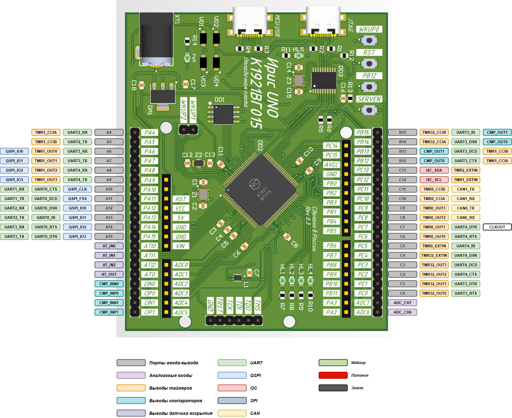
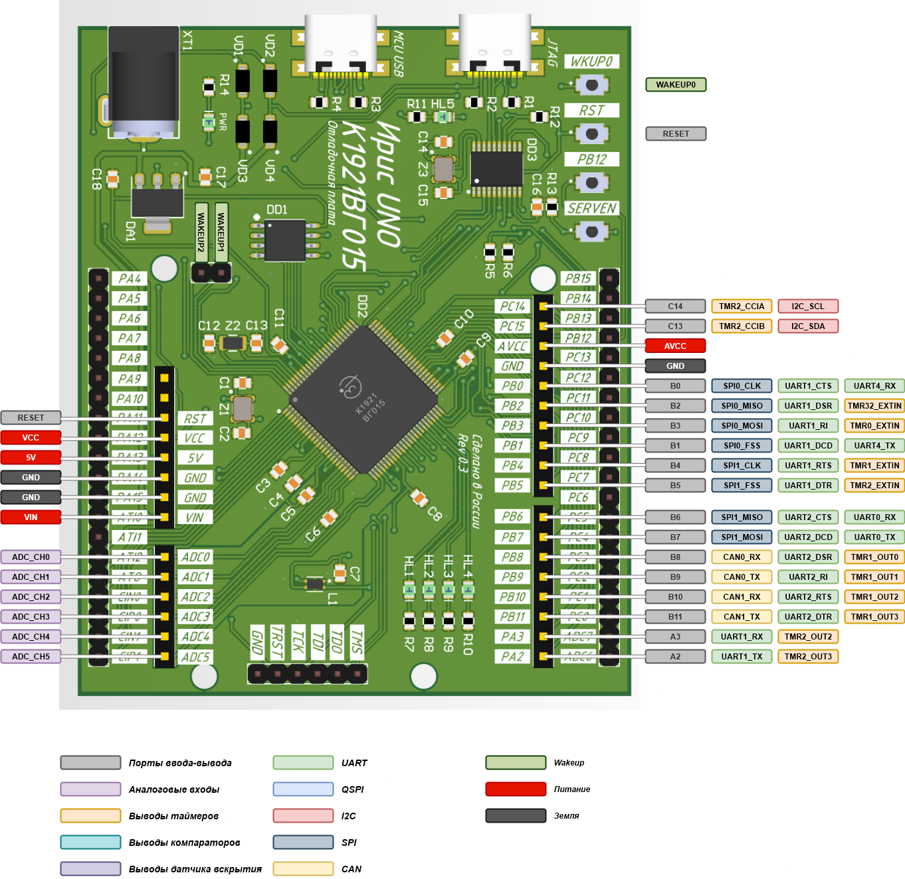

# Ирис UNO-ВГ015
**Проект доступен на [github](https://github.com/djObsidian/Iris-UNO-VG015)**  
**Проект доступен на [gitflic](https://gitflic.ru/project/mikhvad/irisuno-vg015)**   
## Описание
Ирис UNO-ВГ015 это минимальная отладочная плата с отечественным микроконтроллером К1921ВГ015.  

## Возможности
- Компактный форм фактор
- Выведены все пины микроконтроллера
- Поддержка разъема Arduino Uno rev3 - совсместимость с Arduino UNO и mbed шилдами
- Встроенный программатор и USB-UART преобразователь CH347
- Встроенная QSPI память W25Q32JV на 4 Мбайт
- 4 светодиода подключенные к GPIO
- HSE кварцевый резонатор на 12 МГц
- LSE кварцевый резонатор на 32.768 кГц  

## Назначения пинов
### Распиновка МК

  
Источник - РП[1], пины подписаны на плате, GPIO имеют префикс P, т.е. пин A2 подписан на плате как PA2.
### Распиновка внешних коннекторов


### Распиновка коннектора Arduino UNO R3


### Электрическая принципиальная схема

[Схема в формате PDF](IrisUNO.pdf)

## Быстрый старт

### 1. Установка драйвера USB-UART 
Подключите плату к ПК с помощью кабеля USB-C. Windows 10 и новее должен автоматически установить драйвера на USB-UART преобразователь. Если этого не произошло, скачайте и установите драйвер с сайта WCH [3]  
### 2. Установка драйвера USB-JTAG
 Установите драйвер WinUSB с помощью Zadig [4] для устройства USB to UART+JTAG (Interface 2)  
  
### 3. Установка IDE
Далее для установки среды разработки Syntacore IDE следуйте шагам 1-5 из главы 3 руководства "Быстрый старт" [5]  
### 4. Установка OpenOCD
 Установите кастомную сборку OpenOCD с поддержкой К1921ВГ015 и CH347 [6]. Для этого скачайте релиз со страницы релизов, распакуйте c заменой содержимое в папку `tools`, которая находится внутри корневой папки Syntacore IDE `sc-dt`. Это нужно сделать после установки патча `sc-dt_Patch_Niiet_Win32.zip`. При корректной установке в папке `\sc-dt\tools\share\openocd\scripts\interface` должен быть файл `ch347t.cfg`  
### 5. Настройка отладочной сессии
 Следуйте шагу 7 из главы 3 быстрого старта, вместо предоставленной там конфигурации отладчика используйте следующую:
 ```
-s ${eclipse_home}../tools/share/openocd/scripts
-s ${eclipse_home}../tools/share/openocd/scripts/interface/ftdi
-s ${eclipse_home}../tools/share/openocd/scripts/interface
-s ${eclipse_home}../tools/share/openocd/scripts/target
-f ch347t.cfg
-f k1921vg015.cfg
-c "init;halt"
 ```  
 ### 6. Настройки проекта для платы Ирис UNO
 Для запуска примеров из NIIET RISC-V на плате Ирис UNO необходимо поменять символы при сборке проекта. Откройте меню Project -> Properties -> C/C++ Build -> Settings -> GNU RISC-V C Compiler -> Preprocessor  
  
Поменяйте значение символа HSECLK_VAL на 12000000.
Светодиоды расположены на порте C. Для запуска примера Run_leds (а также некоторых других) необходимо заменить `GPIOA` на `GPIOC` в соответствующих местах.  
Для использования `printf` с перенаправлением вывода в UART откройте файл `retarget.c`, находящийся в корне проекта и поменяйте дефайн `SystemCoreClock_uart` на следующий:
```c
#define SystemCoreClock_uart	12000000
```
После этого пример готов к запуску на плате Ирис UNO.  

## Дальнейшие действия
Вы можете обращаться к руководству от НИИЭТ для получения дальнейшей информации. При работе с расширением для VSCode настройки необходимо изменить аналогичным образом для использования отладчика CH347, а также поменять частоту кварца на 12 МГц.

## Ресурсы и источники
1. [Официальная страница продукта на сайте производителя](https://niiet.ru/product/%D0%BA1921%D0%B2%D0%B3015/)
2. [Репозиторий с SDK и документацией](https://gitflic.ru/project/niiet/niiet_riscv_sdk) 
3. [Страница загрузки драйвера USB-UART для CH347](https://www.wch-ic.com/downloads/CH341SER_EXE.html)
4. [Официальный сайт zadig](https://zadig.akeo.ie/)
5. [Быстрый старт NIIET RISC-V](https://niiet.ru/wp-content/uploads/2025/09/%D0%91%D1%8B%D1%81%D1%82%D1%80%D1%8B%D0%B9_%D1%81%D1%82%D0%B0%D1%80%D1%82_NIIET_RISCV-1.pdf)
6. [Сборка OpenOCD от сообщества RUS MCU](https://gitflic.ru/project/rus_mcu/openocd/release)

[1]: https://niiet.ru/product/%D0%BA1921%D0%B2%D0%B3015/
[2]: https://gitflic.ru/project/niiet/niiet_riscv_sdk
[3]: https://www.wch-ic.com/downloads/CH341SER_EXE.html
[4]: https://zadig.akeo.ie/
[5]: https://niiet.ru/wp-content/uploads/2025/09/%D0%91%D1%8B%D1%81%D1%82%D1%80%D1%8B%D0%B9_%D1%81%D1%82%D0%B0%D1%80%D1%82_NIIET_RISCV-1.pdf
[6]: https://gitflic.ru/project/rus_mcu/openocd/release
