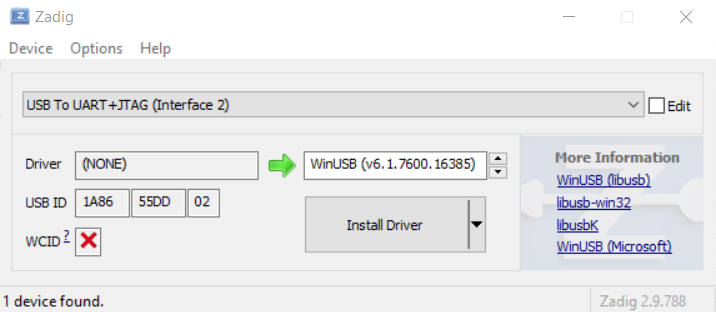
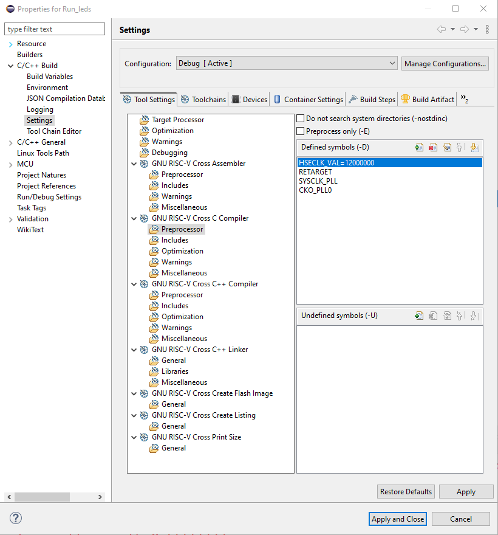

# Iris UNO-VG015
## Description
Iris UNO-VG015 is a minimal development board featuring the domestic microcontroller K1921VG015.

## Features
- Compact form factor
- All microcontroller pins are broken out
- Support for Arduino Uno rev3 connector - compatibility with Arduino UNO and mbed shields
- Built-in programmer and USB-UART converter CH347
- Built-in QSPI memory W25Q32JV with 4 MB
- 4 LEDs connected to GPIO
- 12 MHz HSE crystal oscillator 
- 32.768 kHz LSE crystal oscillator

## Pin Assignments
*TODO: add pinout*  
In the meantime, you can refer to the official guide [1]; the pins are labeled on the board.

## Before you start
Please notice that only *Quick start* manual is translated to english, other docs are in russian.

## Quick Start
### 1. Installing the USB-UART Driver 
Connect the board to the PC using a USB-C cable. Windows 10 and later should automatically install the drivers for the USB-UART converter. If this does not happen, download and install the driver from the WCH website [3].
### 2. Installing the USB-JTAG Driver
Install the WinUSB driver using Zadig [4] for the USB to UART+JTAG device (Interface 2).
  
### 3. Installing the IDE
Next, to install the Syntacore IDE development environment, follow steps 1-5 from Chapter 3 of the "Quick Start" guide [5].  

### 4. Installing OpenOCD
Install a custom build of OpenOCD with support for K1921VG015 and CH347 [6]. To do this, download the release from the releases page, unpack it, and replace the contents in the `tools` folder located inside the root folder of the Syntacore IDE `sc-dt`. This should be done after installing the patch `sc-dt_Patch_Niiet_Win32.zip`. Upon correct installation, the file `ch347t.cfg` should be present in the `\sc-dt\tools\share\openocd\scripts\interface` folder.
### 5. Setting Up the Debug Session
Follow step 7 from Chapter 3 of the quick start, but instead of the provided debugger configuration, use the following:
 ```
-s ${eclipse_home}../tools/share/openocd/scripts
-s ${eclipse_home}../tools/share/openocd/scripts/interface/ftdi
-s ${eclipse_home}../tools/share/openocd/scripts/interface
-s ${eclipse_home}../tools/share/openocd/scripts/target
-f ch347t.cfg
-f k1921vg015.cfg
-c "init;halt"
 ```
 ### 6. Project Settings for the Iris UNO Board
To run examples from NIIET RISC-V on the Iris UNO board, you need to change the symbols during project build. Open the menu Project -> Properties -> C/C++ Build -> GNU RISC-V C Compiler -> Preprocessor

Change the value of the HSECLK_VAL symbol to 12000000. 
To use `printf` with output redirection to UART, open the `retarget.c` file located in the project root and change the define `SystemCoreClock_uart` to the following:
```c
#define SystemCoreClock_uart	12000000
```
After this, the example is ready to run on the Iris UNO board. 

## Further Actions
You can refer to the NIIET guide for further information. When working with the VSCode extension, the settings need to be changed in a similar way to use the CH347 debugger, as well as changing the quartz frequency to 12 MHz.

## Resources and Sources
1. Official product page on the manufacturer's website https://niiet.ru/product/%D0%BA1921%D0%B2%D0%B3015/
2. Repository with SDK and documentation https://gitflic.ru/project/niiet/niiet_riscv_sdk
3. USB-UART driver download page for CH347 https://www.wch-ic.com/downloads/CH341SER_EXE.html
4. Official Zadig website https://zadig.akeo.ie/
5. NIIET RISC-V Quick Start https://gitflic.ru/project/niiet/niiet_riscv_sdk/file?file=doc_en%2FK1921VG015&branch=master
6. OpenOCD build from the RUS MCU community https://gitflic.ru/project/rus_mcu/openocd/release

[1]: https://niiet.ru/product/%D0%BA1921%D0%B2%D0%B3015/
[2]: https://gitflic.ru/project/niiet/niiet_riscv_sdk
[3]: https://www.wch-ic.com/downloads/CH341SER_EXE.html
[4]: https://zadig.akeo.ie/
[5]: https://gitflic.ru/project/niiet/niiet_riscv_sdk/file?file=doc_en%2FK1921VG015&branch=master
[6]: https://gitflic.ru/project/rus_mcu/openocd/release