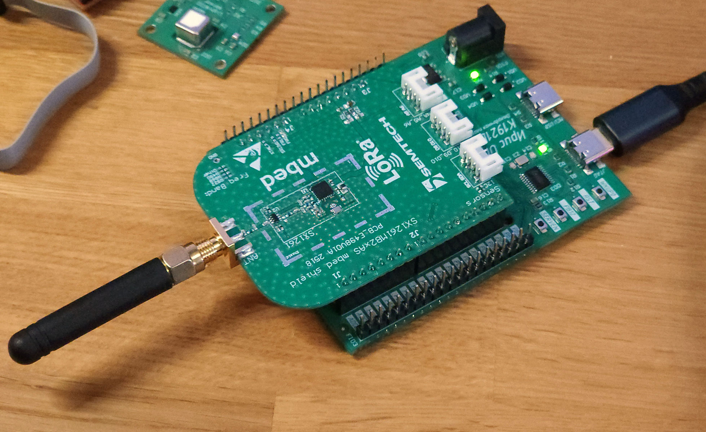

# Примеры работы с микроконтроллером К1921ВГ015

## SX1262_test
Пример работы с чипом SX1262 через SPI. В примере имеется реализация sx126x_hal.c, с использованием функций plib015. В примере осуществляется настройка параметров передачтика.

Примечание. Reset не используется т.к. на данном mbed shield выведен на A0.

### Использованное железо
- IrisUno-VG015
- SX126xMB2xAS

